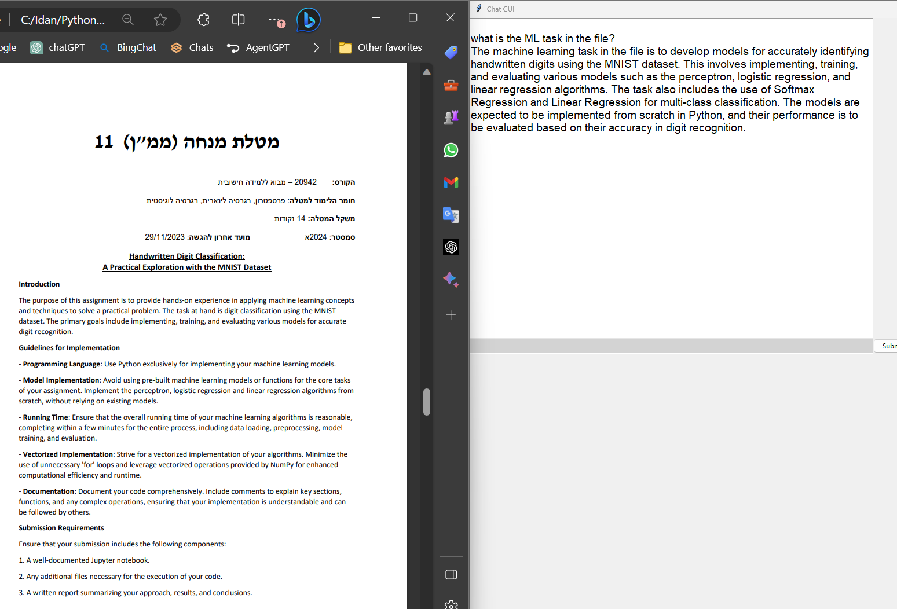

# DocReader
DocReader is a Python script that uses GPT to help you communicate with your txt, pdf, code files and more.

## Options
You can use either OpenAI API with gpt-3.5-turbo or gpt-4. 

Set `gpt4 = False` for gpt-3.5-turbo or `gpt4 = True` for gpt-4
* When switching between models, rename one of the files in the data folder to ensure that the changes take effect.

For shorter answers, set 'similarity_top_k' to lower value in this line:
`    query_engine = index.as_query_engine(similarity_top_k=5)
`

## Prerequisites
* OpenAI API key:
1. Create openai api key in https://beta.openai.com/. 
2. Create a .txt file and copy your openai api key and save it as `openai_api_key.txt`. 
3. Replace `path_to_key` in connect_to_openai function with the path to your `openai_api_key.txt` file.


##  Usage
1. Clone the repository
2. Install the requirements
```bash
pip install -r requirements.txt
```
3. Save files in 'data folder'
4. Run the script
5. Ask questions about the data in the data folder.


## Example 1 - Research Paper


## Example 2 - ML task explanation


## Example 3 - Code documentation


